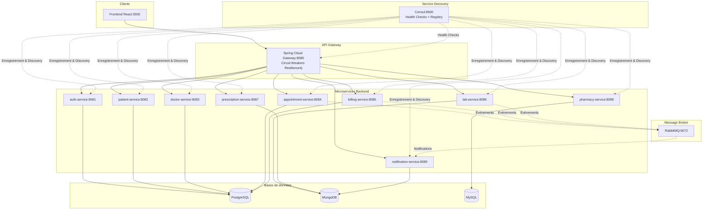

# 🫀 MyHeart - Système de Gestion de Soins de Santé en Microservices

## 📋 Description

**MyHeart** est une application de gestion de soins de santé moderne, construite selon une architecture microservices. Elle permet aux patients de prendre des rendez-vous, aux médecins d'accéder aux dossiers médicaux, aux pharmacies de gérer les prescriptions et aux laboratoires de traiter les résultats d'analyses de manière transparente et efficace.

Le système intègre **Consul** pour la découverte dynamique des services et **Resilience4j** pour la tolérance aux pannes, garantissant la disponibilité de la plateforme même en cas de défaillance partielle.

Ce projet a été réalisé dans le cadre d'un mini-projet pédagogique sur l'architecture orientée services (SOA) et le développement web.

## 🏗️ Architecture

```

🌐 Frontend React (3000)
        ↓
🚪 API Gateway (8080)  ←→  🧭 Consul (8500) - Service Discovery
        ↓
⚙️  Microservices  ←→  🛡️ Resilience4j - Circuit Breakers
        ↓
💾 Bases de données  +  📨 RabbitMQ

```

### 📊 Schéma d'architecture



## 🚀 Technologies utilisées

### Backend
- **Java 17** avec **Spring Boot 3.1.5**
- **Spring Cloud Gateway** - API Gateway
- **Spring Data JPA** - ORM pour PostgreSQL/MySQL
- **Spring Data MongoDB** - ORM pour MongoDB
- **Spring Security** + **JWT** - Authentification
- **Spring Cloud OpenFeign** - Communication inter-services
- **Spring AMQP** - Communication asynchrone avec RabbitMQ
- **Maven** - Gestion de dépendances

### Service Discovery & Résilience
- **Consul 1.17** - Service discovery, enregistrement automatique et health checks
  - Enregistrement automatique de chaque service au démarrage
  - Health checks périodiques via `/actuator/health` (toutes les 15s)
  - Résolution dynamique des adresses IP (plus de configuration en dur)
  - Interface web de monitoring sur `http://localhost:8500`
- **Resilience4j 2.1** - Tolérance aux pannes multicouche
  - **Circuit Breaker** : ouverture automatique à 50% d'échecs, fallback activé
  - **Retry** : 3 tentatives automatiques sur erreurs transitoires
  - **TimeLimiter** : timeout de 5s sur tous les appels inter-services
  - Métriques exposées via Spring Boot Actuator
    
### Frontend
- **React 18** - Framework UI
- **React Router 6** - Navigation
- **React Query** - Gestion d'état et cache
- **Axios** - Client HTTP
- **Material-UI (MUI)** - Composants d'interface
- **React Hook Form** - Gestion des formulaires

### Bases de données
- **PostgreSQL 15** - Données relationnelles (auth, patients, rendez-vous, factures)
- **MongoDB 7** - Données document (prescriptions, résultats labo, notifications)
- **MySQL 8** - Gestion de stock pharmacie

### Infrastructure
- **Docker** & **Docker Compose** - Conteneurisation
- **RabbitMQ** - Message broker
- **Git/GitHub** - Versionnement

## 📁 Structure du projet

```
myheart-microservices/
├── docker-compose.yml                 # Orchestration des conteneurs
├── init-complet.ps1                    # Script d'initialisation des données de test
├── scripts/                            # Scripts d'initialisation des bases
│   ├── init-postgres.sql
│   ├── init-mongodb.js
│   └── init-mysql.sql
├── myheart-common/                      # Module commun (DTOs, constantes)
├── services/                            # Microservices backend
│   ├── api-gateway/                      # API Gateway (port 8080)
│   ├── auth-service/                      # Authentification (port 8081)
│   ├── patient-service/                    # Gestion patients (port 8082)
│   ├── doctor-service/                      # Gestion médecins (port 8083)
│   ├── appointment-service/                  # Rendez-vous (port 8084)
│   ├── billing-service/                       # Facturation (port 8085)
│   ├── lab-service/                            # Laboratoire (port 8086)
│   ├── prescription-service/                    # Prescriptions (port 8087)
│   ├── pharmacy-service/                         # Pharmacie (port 8088)
│   └── notification-service/                      # Notifications (port 8089)
└── frontend/                                # Application React
    ├── public/
    ├── src/
    └── package.json
```

## 🎯 Fonctionnalités par acteur

| Acteur | Fonctionnalités |
|--------|----------------|
| **Patient** | ✅ Voir la liste des médecins<br>✅ Prendre rendez-vous<br>✅ Voir ses prescriptions<br>✅ Consulter ses résultats d'analyses<br>✅ Accéder à son dossier médical |
| **Médecin** | ✅ Voir ses patients<br>✅ Accéder aux dossiers médicaux complets<br>✅ Prescrire des médicaments<br>✅ Voir les résultats de laboratoire<br>✅ Gérer son agenda |
| **Pharmacie** | ✅ Voir les prescriptions en attente<br>✅ Délivrer les médicaments<br>✅ Gérer l'inventaire<br>✅ Alertes de stock faible |
| **Laboratoire** | ✅ Voir les tests en attente<br>✅ Enregistrer les résultats<br>✅ Uploader des fichiers<br>✅ Notifier les médecins |

## 🚦 Prérequis

- [Docker](https://www.docker.com/products/docker-desktop/) (version 24.0+)
- [Docker Compose](https://docs.docker.com/compose/install/) (inclus avec Docker Desktop)
- [Git](https://git-scm.com/downloads)
- [Node.js](https://nodejs.org/) (18+) - pour le développement frontend
- [Java JDK](https://adoptium.net/) (17+) - pour le développement backend
- [Maven](https://maven.apache.org/) (3.9+) - pour builder les services

## 🏁 Installation et démarrage

### 1. Cloner le dépôt

```bash
git clone https://github.com/ZainabElbouyed/myheart-microservices.git
cd myheart-microservices
```

### 2. Builder le module commun (myheart-common)

Le module commun doit être installé en premier car il contient les DTOs et constantes partagés.

```bash
# Sous Windows (PowerShell)
cd myheart-common
mvn clean install
```

### 3. Builder tous les microservices

```bash
# Revenir à la racine
cd ..

# Builder tous les services (Windows PowerShell)
docker-compose build --no-cache
}
```

### 4. Lancer Consul et les bases de données en premier

⚠️ Consul doit démarrer avant tous les microservices pour que l'enregistrement fonctionne correctement.

```bash
# Lancer uniquement Consul et les bases de données
docker-compose up -d consul postgres mongodb mysql rabbitmq

# Vérifier que les bases sont prêtes (attendre 30 secondes)
Start-Sleep -Seconds 30
```

### 5. Lancer les microservices dans l'ordre

```bash
# Lancer auth-service (dépend de postgres)
docker-compose up -d auth-service

# Attendre que auth-service soit prêt
Start-Sleep -Seconds 15

# Lancer les services qui dépendent de auth-service
docker-compose up -d patient-service doctor-service

# Attendre
Start-Sleep -Seconds 15

# Lancer les services restants
docker-compose up -d appointment-service billing-service lab-service prescription-service pharmacy-service notification-service

# Enfin, lancer l'API Gateway
docker-compose up -d api-gateway

# Vérifier que tous les services sont démarrés
docker-compose ps
```

### 6. Initialiser les données de test

```powershell
# Exécuter le script d'initialisation des données de test (PowerShell)
.\init-complet.ps1
```

Ce script va :
- Créer les utilisateurs dans auth-service
- Créer les patients et médecins dans patientdb
- Créer un rendez-vous de test
- Créer une prescription
- Créer un résultat de laboratoire
- Créer un pharmacien et des médicaments
- Créer une facture

### 7. Lancer le frontend

```bash
# Option 1 : Via Docker
docker-compose up -d frontend

# Option 2 : En local (pour le développement)
cd frontend
npm install
npm start
```

### 8. Vérifier que tout fonctionne

```bash
# Voir tous les conteneurs en cours d'exécution
docker-compose ps

# Voir les logs d'un service spécifique
docker-compose logs -f appointment-service

# Voir les logs de tous les services
docker-compose logs -f
```

## 🌐 Accès à l'application

- **Frontend** : http://localhost:3000
- **API Gateway** : http://localhost:8080
- **Consul UI** : http://localhost:8500
- **RabbitMQ Management** : http://localhost:15672 (login: myheart/myheart123)

## 👤 Comptes de démonstration

| Rôle | Email | Mot de passe |
|------|-------|--------------|
| Patient | thomas.martin@example.com | Thomas@2024#Secure |
| Médecin | alexandre.richard@clinique.fr | Alexandre@2024#Secure |
| Laboratoire | sophie.renaud@laboratoire.fr | Sophie@2024#Secure |
| Pharmacie | philippe.mercier@pharmacie.fr | Philippe@2024#Secure |

## 🛠️ Commandes de développement

### Backend (Spring Boot)

```bash
# Builder un service spécifique
cd services/patient-service
mvn clean package

# Exécuter en local (sans Docker)
mvn spring-boot:run -Dspring-boot.run.profiles=local

# Tester un service
mvn test
```

### Frontend (React)

```bash
cd frontend
npm install
npm start           # Lancement en mode développement
npm run build       # Build pour la production
npm test            # Lancer les tests
```

### Docker

```bash
# Rebuilder un service spécifique
docker-compose build patient-service

# Redémarrer un service
docker-compose restart patient-service

# Voir les logs d'un service
docker-compose logs -f patient-service

# Arrêter tous les services
docker-compose down

# Arrêter et supprimer les volumes (réinitialisation complète)
docker-compose down -v
```

### Script d'initialisation (si besoin de réinitialiser les données)

```powershell
# Réinitialiser toutes les données de test
.\init-complet.ps1
```

## 📊 Points d'entrée API

| Service | URL de base | Port |
|---------|-------------|------|
| API Gateway | http://localhost:8080/api | 8080 |
| Auth Service | http://localhost:8081/api/auth | 8081 |
| Patient Service | http://localhost:8082/api/patients | 8082 |
| Doctor Service | http://localhost:8083/api/doctors | 8083 |
| Appointment Service | http://localhost:8084/api/appointments | 8084 |
| Billing Service | http://localhost:8085/api/billing | 8085 |
| Lab Service | http://localhost:8086/api/lab | 8086 |
| Prescription Service | http://localhost:8087/api/prescriptions | 8087 |
| Pharmacy Service | http://localhost:8088/api/pharmacy | 8088 |
| Notification Service | http://localhost:8089/api/notifications | 8089 |

## 📈 Communication inter-services

| Type | Technologie | Cas d'usage |
|------|-------------|-------------|
| **Synchrone** | REST + Feign Client + Consul | Vérification patient/médecin, création facture |
| **Asynchrone** | RabbitMQ | Notifications, résultats labo |
| **Résilience** | Resilience4j Circuit Breaker | Fallback automatique si service indisponible |

## 🧪 Tests

```bash
# Tester tous les services
for service in services/*/; do (cd "$service" && mvn test); done

# Tester un service spécifique
cd services/patient-service
mvn test
```

## 👨‍💻 Auteur

**Zainab Elbouyed**
- GitHub: [@ZainabElbouyed](https://github.com/ZainabElbouyed)
